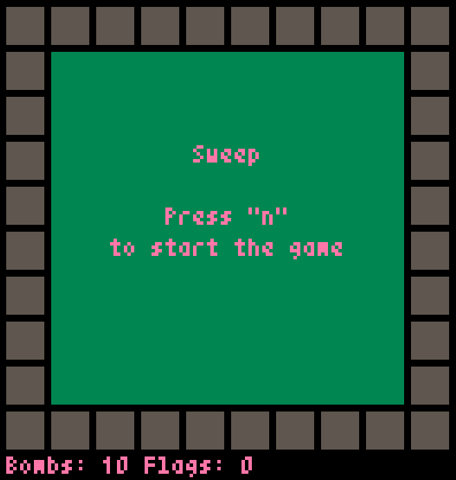

# Sweep

## Gameplay
### Buttons
* **N** to start a new game
* **Q** to quit
* **left mouse click** to uncover a field
* **right mouse click** to toggle a flag
### Rules
If you uncover all the fields without a bomb, you win.
If you click on a field with a bomb you lose.

## Setup
*   Install:
    * Python
    * [pyxel](https://github.com/kitao/pyxel#how-to-install)
*   Download this repository.
*   To play run this command: `python sweep.py`.

